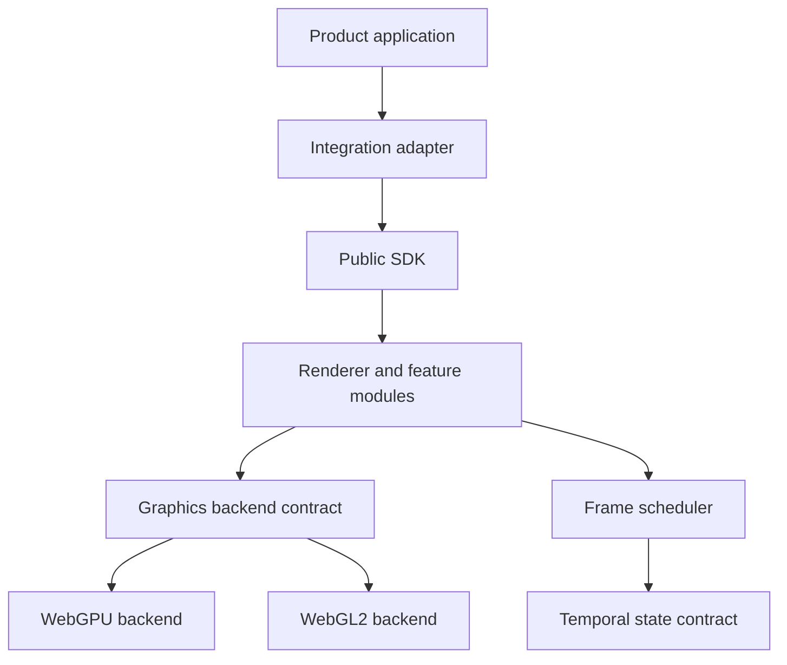

# Architecture Overview

## Purpose

Kyxos Render Engine is an independent real-time rendering subsystem. Product applications consume a stable public SDK; they do not reach into Renderer Core, graphics backends, render passes, Shader caches, or GPU-native objects.

The mandatory dependency direction is:



Integration adapters and the WebGL2 backend are planned layers. They do not exist in Phase 0 and are not simulated by placeholders.

## Accepted and active package graph

| Package                         | Responsibility                                                          | Runtime dependencies                                                          |
| ------------------------------- | ----------------------------------------------------------------------- | ----------------------------------------------------------------------------- |
| `@kyxos/render-core`            | Errors, typed events, handles, deterministic disposal                   | None                                                                          |
| `@kyxos/render-math`            | Vectors, quaternions, matrices, bounds, and frusta                      | None                                                                          |
| `@kyxos/render-geometry`        | Immutable mesh data, bounds, primitives, and tangent generation         | Math                                                                          |
| `@kyxos/render-environment`     | Immutable prefiltered HDR cube/LUT identities and caller-owned registry | Core                                                                          |
| `@kyxos/render-material-core`   | Color, texture semantics, UV transforms, and feature identities         | Core                                                                          |
| `@kyxos/render-material-pbr`    | Metallic-roughness state plus direct, reference, and runtime IBL math   | Core, Material Core                                                           |
| `@kyxos/render-scene`           | Entity hierarchy, cached world transforms, visibility, layers, bounds   | Core, Math                                                                    |
| `@kyxos/render-camera`          | Perspective, Jittered Previous/Current matrices, framing, and orbit     | Core, Math, Scene, Temporal                                                   |
| `@kyxos/render-visibility`      | Mesh Renderer components, culling, Draw Lists, and queue sorting        | Camera, Core, Geometry, Math, Scene                                           |
| `@kyxos/render-backend-api`     | Backend lifecycle, opaque GPU resources, uploads, and diagnostics       | Core                                                                          |
| `@kyxos/render-backend-webgpu`  | WebGPU implementation boundary; concrete implementation starts Phase 1  | Backend API, Core                                                             |
| `@kyxos/render-temporal`        | History, convergence, Jitter, and deterministic Dynamic TAA resolve     | Core                                                                          |
| `@kyxos/render-frame-scheduler` | Dirty-only and opt-in four-mode injected frame scheduling               | Core, Temporal                                                                |
| `@kyxos/render-renderer`        | Renderer lifecycle, direct/IBL PBR, mapped resources, and GPU caches    | Backend API, Camera, Core, Environment, Geometry, Material, Scene, Visibility |
| `@kyxos/render-sdk`             | Product-facing composition root and only supported consumer entry       | Public engine packages                                                        |
| `@kyxos/render-testing`         | Mock Backend and deterministic frame driver                             | Backend API, Core, Frame Scheduler                                            |
| `@kyxos/render-playground`      | Independent acceptance and development application                      | SDK, Testing                                                                  |

Every package exposes only its root entry. Runtime code may not import another workspace's private source path.

## Runtime ownership

1. A caller creates a renderer through `@kyxos/render-sdk`.
2. The renderer owns the selected backend and its scheduler.
3. Backends own native GPU resources and expose only opaque handles plus immutable diagnostics.
4. A dirty event requests at most one pending frame; multiple synchronous invalidations coalesce.
5. The accepted dirty-only strategy returns directly to `sleeping`. An explicitly injected Temporal
   Scheduler progresses through Interactive, Stabilizing, Accumulating, and Sleeping without a
   permanent RAF.
6. Device or context loss clears invalid resources and suspends pending work.
7. `dispose()` is idempotent, cancels scheduled work, unregisters owned extensions, destroys resources, and returns diagnostics to the active-resource baseline.

No global mutable engine singleton participates in this lifecycle.

Dynamic and static histories are separate owner-scoped records. Their immutable signatures cover
device, scene, camera, viewport, geometry, material, lighting, environment, and post-process
revisions. Signature mismatch rejects reuse before sampling; GPU Textures remain owned and released
by their Render Feature rather than by the CPU history contract.

## Backend policy

WebGPU is the primary backend. WebGL2 is a capability-limited compatibility backend, not an emulation of WebGPU. Both implement the backend-neutral contract, publish an immutable capability report, and keep native objects private.

The public SDK will support explicit backend selection and an `auto` policy. Only `auto` may fall back from unavailable WebGPU to WebGL2. An explicitly requested backend must either initialize that backend or return a stable, actionable error.

See [ADR-001](../adr/ADR-001-webgpu-first-webgl2-fallback.md) and [ADR-002](../adr/ADR-002-coordinate-and-color-conventions.md).

## Extensibility

Advanced behavior enters through registrations rather than edits to a monolithic render function:

```ts
engine.registerRenderFeature(feature);
engine.registerMaterialExtension(extension);
engine.registerAssetDecoder(decoder);
engine.registerPreviewPreset(preset);
```

Render passes declare inputs and outputs to a Render Graph. Imported resources remain caller-owned; transient resources are graph-owned for their declared lifetimes. Disabled features must not schedule their passes or retain unnecessary resources.

## Product isolation

Renderer Core and all lower layers are forbidden from depending on React, Next.js, Zustand, product routes, accounts, billing, databases, analytics, or Texture Lab state. A future Texture Lab integration is allowed only through:

```text
Texture Lab
→ @kyxos/render-integration-texture-lab
→ @kyxos/render-sdk
```

The standalone Playground is the executable proof that the engine can initialize and complete its lifecycle without a product application.

## Verification

The authoritative local and CI command is:

```bash
pnpm verify
```

It runs formatting, lint, strict type checking, unit tests, dependency and cycle checks, Shader capability validation, production builds, bundle budgets, and Playwright acceptance tests. See [Dependency Rules](./dependency-rules.md) for the enforced graph.
